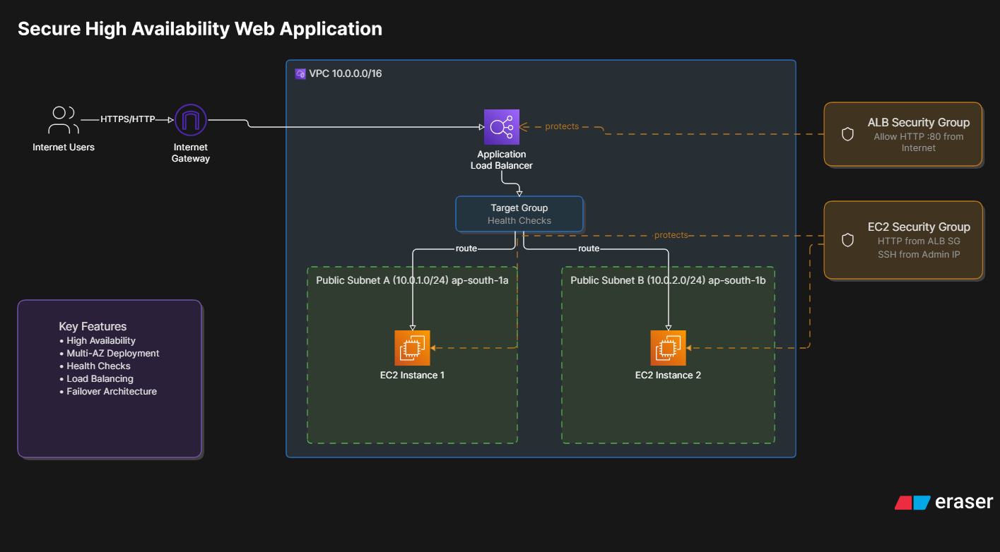

# Secure High Availability Web Application

## Project Overview

This project demonstrates how to build a highly available web application on AWS using a custom VPC, multiple Availability Zones, EC2 instances, and an Application Load Balancer (ALB).

The application is deployed across two Availability Zones to eliminate a single point of failure. An Application Load Balancer continuously monitors the health of backend servers and routes traffic only to healthy instances.

---

## Project Objectives

- Build a custom VPC from scratch
- Configure public networking components
- Deploy EC2 instances across multiple Availability Zones
- Configure an Application Load Balancer
- Implement Health Checks
- Test High Availability and Failover
- Restrict backend access using Security Groups

---
## Architecture Diagram



---

## Architecture

```text
                          Internet
                              │
                              ▼
                    Internet Gateway
                              │
                              ▼
                  Application Load Balancer
                              │
                    ┌─────────┴─────────┐
                    │                   │
                    ▼                   ▼

           Public Subnet A      Public Subnet B
            10.0.1.0/24          10.0.2.0/24

                 │                    │
                 ▼                    ▼

             EC2-1                EC2-2

            AZ-1a                AZ-1b
```

---

## AWS Services Used

- Amazon VPC
- Subnets
- Internet Gateway
- Route Tables
- Security Groups
- Amazon EC2
- Application Load Balancer
- Target Groups

---

## Implementation Steps

### Step 1: Create Custom VPC

Created a VPC:

```text
CIDR: 10.0.0.0/16
```

This VPC provides logical network isolation for all resources.

---

### Step 2: Create Public Subnets

Created two public subnets in different Availability Zones.

#### Public Subnet A

```text
10.0.1.0/24
ap-south-1a
```

#### Public Subnet B

```text
10.0.2.0/24
ap-south-1b
```

---

### Important Learning

While creating subnets, the following option can be enabled:

```text
Auto Assign Public IPv4 Address
```

This automatically assigns public IPs to instances launched inside the subnet.

Even if this option is disabled at subnet level, public IPs can still be assigned during EC2 launch by selecting:

```text
Auto-assign Public IP = Enable
```

---

### Step 3: Create Internet Gateway

Created an Internet Gateway and attached it to the VPC.

Purpose:

```text
Allow resources inside the VPC
to communicate with the Internet.
```

---

### Step 4: Create Route Table

Created a Public Route Table.

Added route:

```text
Destination:
0.0.0.0/0

Target:
Internet Gateway
```

Associated the route table with both public subnets.

---

### Step 5: Create Security Groups

#### ALB Security Group

Inbound:

```text
HTTP 80 → 0.0.0.0/0
```

This allows users to access the Load Balancer.

---

#### EC2 Security Group

Inbound:

```text
HTTP 80 → ALB-SG

SSH 22 → My IP
```

This ensures application traffic reaches EC2 only through the ALB.

---

### Why Separate Security Groups?

Using separate Security Groups helps enforce controlled traffic flow.

```text
Internet
    │
    ▼
   ALB
    │
    ▼
   EC2
```

Users access the application through the ALB instead of directly accessing EC2 instances.

---

### Step 6: Launch EC2 Instances

Created two EC2 instances.

#### Instance 1

```text
Web Server 1
AZ-a
```

#### Instance 2

```text
Web Server 2
AZ-b
```

Each instance hosts a unique web page.

---

### Step 7: Create Target Group

Created a Target Group and registered:

```text
EC2-1
EC2-2
```

Health Check Configuration:

```text
Protocol: HTTP
Path: /
```

---

### Step 8: Create Application Load Balancer

Created an Internet-Facing ALB.

Configuration:

```text
Listener:
HTTP : 80
```

Attached:

```text
Target Group
```

AWS automatically generated a DNS endpoint for accessing the application.

---

## Traffic Flow

```text
User
  │
  ▼
ALB DNS
  │
  ▼
Application Load Balancer
  │
  ▼
Target Group
  │
 ┌┴┐
 ▼ ▼
EC2 Instances
```

---

## Health Check Process

The Application Load Balancer continuously checks the health of registered targets.

```text
Healthy Target
    ↓
Receives Traffic

Unhealthy Target
    ↓
Removed From Traffic Routing
```

---

## High Availability Design

The application is deployed across multiple Availability Zones.

```text
AZ-1a
 └── EC2-1

AZ-1b
 └── EC2-2
```

This design reduces the risk of a single Availability Zone failure affecting application availability.

---

## Failover Test

To validate High Availability:

### Action Performed

Stopped:

```text
EC2-1
```

### Observation

Target Group Status:

```text
EC2-1 → Unhealthy

EC2-2 → Healthy
```

### Result

The Application Load Balancer automatically routed all traffic to the healthy server.

The application remained accessible without manual intervention.

---

## Understanding Temporary 502 Errors

During failover testing, a temporary:

```text
502 Bad Gateway
```

response may be observed.

Reason:

```text
ALB requires time to complete
health check evaluations.
```

Once the failed server is marked unhealthy, traffic is routed only to healthy instances.

---

## Key Learnings

- Built a custom VPC from scratch.
- Configured public networking components.
- Created and associated route tables.
- Worked with Security Groups and network traffic control.
- Deployed an Application Load Balancer.
- Configured Target Groups and Health Checks.
- Implemented a Multi-AZ architecture.
- Performed failover validation.
- Understood how ALB routes traffic only to healthy targets.
- Learned the difference between subnet-level and instance-level public IP assignment.
- Understood how Security Groups can be used to restrict direct access to EC2 instances.

---

## Future Improvements

This project can be enhanced by adding:

- Amazon Route53
- HTTPS using ACM Certificates
- Auto Scaling Group
- Private Subnets
- NAT Gateway
- AWS Systems Manager Session Manager

---